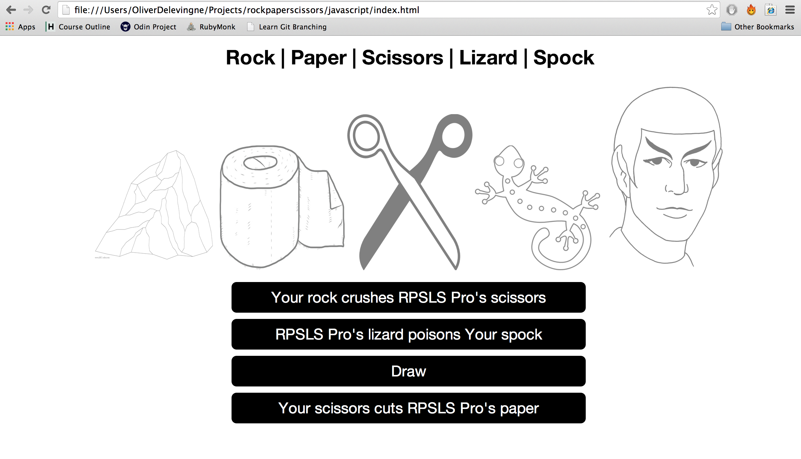

Rock, Paper, Scissors, Lizard, Spock
===

As a part of week 7 at [Makers Academy], we were given the task to implement the [Rock, Paper, Scissors, Lizard, Spock] game in Javascript.




Learning objectives of exercise
----
Basic Javascript, Jquery and Jasmine

Technologies used
----
- Javascript
- jQuery
- Jasmine.js
- HTML5
- CSS3
- Github

How to run it
----
```sh
git clone https://github.com/odelevingne/rock_paper_scissors
cd rockpaperscissors
open javascript/index.html
```
How to run tests
----
```sh
cd javascript
open SpecRunner.html
```


[Makers Academy]:http://www.makersacademy.com
[Rock, Paper, Scissors, Lizard, Spock]:http://en.wikipedia.org/wiki/Rock-paper-scissors-lizard-Spock
